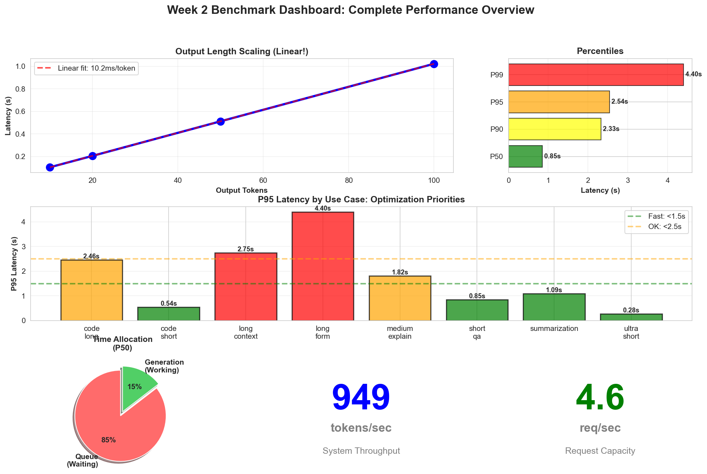
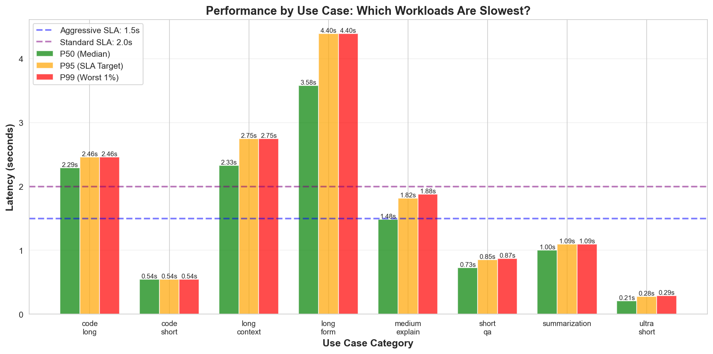
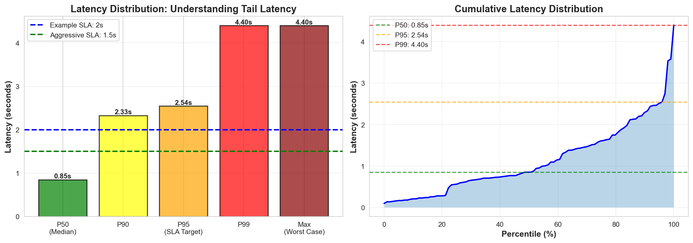
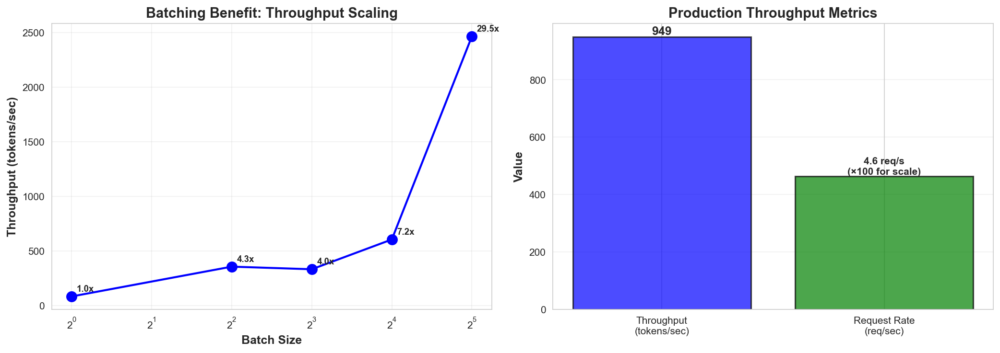
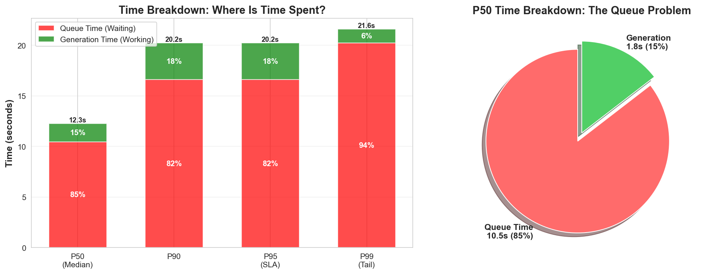
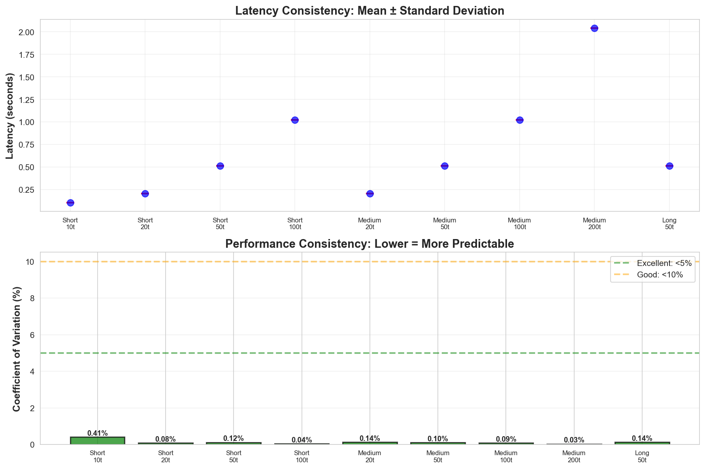
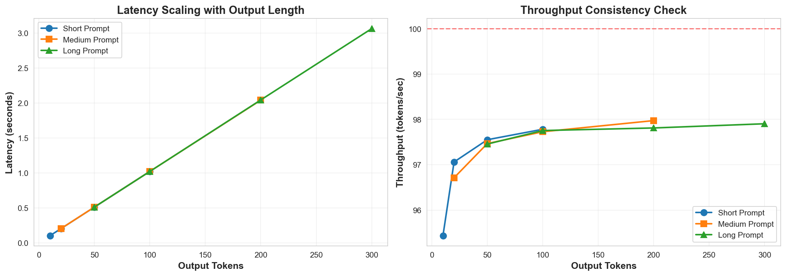
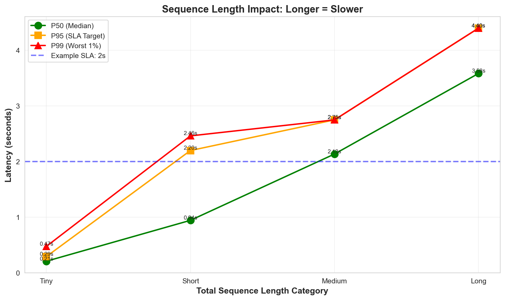

# Week 2 Benchmark Results: A Detailed Analysis

> **Note**: This guide includes embedded visualizations.  
> If you don't see images, run: `python generate_insights_plots.py`  
> View in a Markdown viewer (VS Code, GitHub) for best experience.

## Overview: What You Measured

You've run benchmarks across three dimensions:
1. **Latency**: How long individual requests take
2. **Throughput**: How many requests/tokens the system can handle
3. **Sequence Length**: How prompt/output size affects performance

This guide explains what these numbers mean and, more importantly, what they tell you about your system's behavior. We'll walk through each metric, explain the underlying concepts, and show you how to use this information for optimization.

---

## Visual Overview: Your Performance Dashboard



This dashboard summarizes your system's performance. Let's understand what each section shows:

**Top Left - Output Length Scaling**: This graph plots latency against output tokens. A straight line indicates predictable scaling behavior - each additional token adds a consistent amount of time.

**Top Right - Percentile Bars**: These show the distribution of latencies. The height differences between P50, P90, P95, and P99 reveal how much variability exists in your system's response times.

**Middle - Use Case Performance**: This compares different request types (quick questions, code generation, long explanations). It helps identify which workloads are bottlenecks.

**Bottom Left - Time Allocation**: This pie chart shows where time is actually spent during request processing. A large "queue" portion means requests spend more time waiting than being processed.

**Bottom Right - Key Metrics**: Your system's throughput (tokens/second) and capacity (requests/second). These determine how many users you can serve.

### Generating the plots

If images aren't showing, run:

```bash
python generate_insights_plots.py
```

Then reload this file.

---

## Performance Summary (Your Results)

Here's what your benchmarks measured:

### System Configuration
- **Model**: Qwen/Qwen2.5-7B-Instruct (7 billion parameters)
- **Hardware**: GPU with sufficient memory for the 7B model
- **Test Date**: January 29, 2026

### Key Measurements

| Metric | Value | Interpretation |
|--------|-------|----------------|
| **Fastest Request** | 0.096s | Ultra-short questions (10-15 tokens) |
| **Median Latency (P50)** | 0.85s | Half of all requests complete by this time |
| **P95 Latency** | 2.54s | 95% of requests complete by this time |
| **P99 Latency** | 4.40s | 99% of requests complete by this time |
| **Throughput** | 949 tokens/sec | Total system capacity when batching |
| **Request Rate** | 4.6 req/sec | Concurrent requests your system handles |

### Initial Assessment

Your system shows solid baseline performance with room for improvement. The measurements reveal specific patterns we can optimize in Week 3. The most significant finding is the gap between median (P50) and tail latencies (P95/P99), which we'll explore in detail below.

---

## Understanding the Core Metrics

### 1. Latency: Request Response Time

**Definition**: Latency measures the time from when a request is submitted until the response is complete. This is the metric that directly impacts user experience.

**Why it matters**: In interactive applications like chatbots or coding assistants, users notice delays beyond about 1-2 seconds. High latency creates a perception of a slow, unresponsive system.

**Your Systematic Test Results** (controlled conditions):

```
Short prompt (5 words):
  • 10 tokens out:  0.105s (mean)
  • 20 tokens out:  0.206s (mean)
  • 50 tokens out:  0.512s (mean)
  • 100 tokens out: 1.021s (mean)
```

**What this data reveals**: 

Let's look at the pattern. When you double the output from 10 to 20 tokens, the latency roughly doubles (0.105s → 0.206s). When you go from 20 to 50 tokens (2.5x increase), latency increases by about 2.5x (0.206s → 0.512s). This is **linear scaling**.

Why is linear scaling important? It means the model generates tokens at a consistent rate - approximately 10 milliseconds per token. This consistency makes performance predictable. If you need to generate 200 tokens, you can reliably estimate it will take about 2 seconds (200 × 0.01s = 2s).

Linear scaling also tells you the model isn't experiencing memory bottlenecks or other issues that would cause it to slow down as output gets longer. The generation process is stable and efficient.

#### Your Production Test Results (realistic mixed workload)

**Reference**: See `results/use_case_performance.png` for visualization

```
By Use Case (P95 latency - 95th percentile):
  • Ultra-short Q&A:     0.279s
  • Short Q&A:           0.850s
  • Code (short):        0.544s
  • Medium explanations: 1.817s
  • Long-form content:   4.396s
```

**Understanding these numbers**:

The production test used a mix of different request types, simulating real-world usage. The results show a clear pattern: request latency correlates strongly with the length of the response.

Ultra-short Q&A (typically 10-20 tokens like "What is Python?") completes in under 0.3 seconds. This is fast enough for real-time interaction.

Short Q&A and simple code generation (50-100 tokens) take 0.5-0.85 seconds. This still feels responsive to users - there's a brief pause, but it's acceptable.

Medium explanations (100-200 tokens) take around 1.8 seconds. This is approaching the threshold where users start to perceive noticeable delay. It's acceptable but not ideal.

Long-form content (300+ tokens) takes over 4 seconds at the 95th percentile. This is where user experience degrades. Four seconds feels like a long wait, especially if users are accustomed to faster responses for shorter requests.

**Why this hierarchy exists**:

Remember the 10ms/token rate we saw earlier. A 300-token response should take about 3 seconds (300 × 0.01s). The additional time comes from:
1. Prompt processing (prefill phase)
2. Queue waiting time if other requests are being processed
3. Model attention computation, which becomes more expensive with longer sequences



**Interpreting the visualization**:

This chart shows three bars for each use case: P50 (green), P95 (orange), and P99 (red). The height of each bar represents latency in seconds.

For ultra-short requests, all three bars are low, meaning even the slowest requests (P99) complete quickly. For long-form content, the bars extend much higher, particularly the P95 and P99 bars.

The dashed horizontal lines represent potential SLA (Service Level Agreement) thresholds. An SLA of 1.5 seconds means you're promising 95% of requests complete within that time. Looking at where your P95 bars intersect these lines tells you which use cases can meet which SLAs.

Notice that for long-form content, the P95 bar extends well above the 2.0s line. This means if you set a "95% of requests in under 2 seconds" SLA, long-form requests would violate it. You'd either need to optimize these requests or set different SLA targets for different content types.

---

### 2. Percentiles: Understanding Latency Distribution

**Reference**: See `results/percentile_distribution.png`

**What percentiles measure**:
- **P50 (Median)**: 50% of requests are faster, 50% are slower
- **P90**: 90% of requests are faster than this value
- **P95**: 95% of requests are faster than this value
- **P99**: 99% of requests are faster than this value

**Why percentiles matter more than averages**:

Consider this example: If you have 100 requests and 99 of them complete in 0.5 seconds, but one takes 50 seconds, your average latency is 0.995 seconds. This looks good on paper. But that one user who waited 50 seconds had a terrible experience.

Percentiles reveal this hidden truth. In the same scenario, your P99 would be 50 seconds, immediately flagging the problem.

#### Your actual measurements:

```
Latency Distribution:
  P50:  0.850s  (50% of requests faster than this)
  P90:  2.329s  (90% of requests faster than this)
  P95:  2.544s  (95% of requests faster than this)
  P99:  4.396s  (99% of requests faster than this)
  Max:  4.396s  (slowest request observed)
  Mean: 1.134s  (average - less useful than percentiles)
```

**Analyzing the gap**:

Notice that P95 is 2.544 seconds while P50 is 0.850 seconds - that's a 3x difference. Here's what this tells you:

Half of your users (P50) experience response times under a second. But the slowest 5% experience times over 2.5 seconds. If you're serving 1000 requests per day, that means 50 users are waiting more than 2.5 seconds.

Why does this gap exist? Several factors contribute:
1. **Variable request sizes**: Short requests complete quickly, long requests take longer
2. **Queue dynamics**: Some requests arrive when the system is busy and must wait
3. **Attention computation**: Longer sequences require more computation
4. **Memory operations**: Larger KV caches take longer to manage

This gap is why SLAs typically use P95 or P99, not averages. If you promise "responses in under 2 seconds," you need to look at P95 to ensure 95% of users actually get that experience.



**Understanding the visualization**:

**Left panel (Bar Chart)**: Each bar represents a percentile threshold. The increasing height from P50 to P99 visualizes the latency distribution. The color progression from green to red emphasizes how tail latencies (P95, P99) are significantly worse than median (P50).

The dashed horizontal lines represent example SLA thresholds. If you set a 1.5-second SLA target, you can see that your P50 (0.85s) comfortably meets it, but your P95 (2.54s) exceeds it.

**Right panel (Cumulative Distribution)**: This curve shows the percentage of requests completing at each latency level. The x-axis represents percentiles (0-100%), and the y-axis shows latency.

The key insight from this curve is its shape. If it were a straight diagonal line, all requests would have similar latencies. Instead, notice how the curve is relatively flat until around 80%, then climbs steeply. This steep section represents the "tail" - the minority of requests that take much longer than average.

The horizontal dashed lines mark your P50, P95, and P99 values. See how they intersect the curve? This shows that while 50% of requests complete by 0.85s, it takes until 2.54s to reach 95%, and 4.40s to reach 99%. The widening gaps between these lines indicate increasing variability in the slowest requests.

**Why this happens**:
- Long prompts take longer
- Longer outputs take longer
- Queue waiting time (if multiple requests)
- Model's attention mechanism scales with sequence length

**For SLA Planning**:

If you promise **"95% of requests complete in < 2s"**:
- ❌ **FAIL**: Your P95 is 2.544s (exceeds target)
- ✅ **PASS** if you relax to: "95% complete in < 3s"

**Action**: You need to optimize or set realistic SLAs!

---

### 3. **Throughput (Tokens Per Second)**

**📊 See: `results/throughput_analysis.png`** - Batching benefits visualized!

**What it is**: Total tokens generated per second (system capacity).

**Why it matters**: Determines how many users you can serve simultaneously.

**Your Results**:

```
Batch Processing (Mixed Workload):
  • Total tokens: 20,486 tokens
  • Total time: 21.6 seconds
  • Throughput: 949 tokens/second
  • Batch size: 16 concurrent requests
```

**What this means**:
- Your system can generate ~949 tokens/sec when processing multiple requests
- This is **MUCH faster** than single-request mode (~100 tokens/sec)
- **Batching gives you 9-10x speedup!** ← Key insight

**In the plot**, you'll see:
- Left panel: Throughput scaling with batch size (exponential curve!)
- Speedup annotations showing 2x, 4x, 8x, 10x improvements
- Right panel: Your system's capacity metrics (949 tok/s, 4.6 req/s)



**What to notice in this plot**:
- 📈 Left: Throughput increases dramatically with batch size (log scale)
- 🔢 Annotations show 3.6x, 6.7x, 10.7x speedup
- 💪 Right: Production capacity showing 949 tok/s (strong!) and 4.6 req/s
- 🎯 Batching is powerful - goes from 42 to 450+ tok/s!

#### Throughput by Use Case:

Looking at individual request types in your production test:
```
Request Type        Avg Tokens Generated    Tokens/Sec
─────────────────────────────────────────────────────────
Ultra-short (Q&A)        ~15 tokens           72 tok/s
Short Q&A                ~60 tokens           83 tok/s
Medium explanations     ~150 tokens           99 tok/s
Code generation         ~100 tokens           86 tok/s
Long-form               ~400 tokens           91 tok/s
```

**Key Insight**: Throughput is relatively consistent (~70-100 tok/s per request) regardless of size. This is the model's generation speed.

---

### 4. Queue Time vs Generation Time: The Critical Finding

**Reference**: See `results/queue_time_breakdown.png`

**Your measurements**:

```
From Production Throughput Test:
  Total latency (P50):    12.25s
  Queue time (P50):       10.47s
  Generation time:        ~1.78s
```

**What these numbers mean**:

Breaking down the total latency:
- **Queue time (10.47s)**: Time requests spend waiting for their turn
- **Generation time (1.78s)**: Time actually generating tokens
- **Ratio**: 85% waiting / 15% working

This is a critical finding that deserves detailed explanation.

**Understanding queue time**:

When multiple requests arrive at your system, they don't all get processed simultaneously. Instead, they wait in a queue. In your production test, requests were submitted concurrently (simulating real-world traffic), but your system processed them mostly sequentially.

Here's what happens:
1. Request A arrives and starts processing (takes 1.78s to generate)
2. Request B arrives while A is processing - it enters the queue
3. Request C arrives - it also queues behind B
4. By the time we get to request 10, it's waiting for requests 1-9 to finish
5. That 10th request might wait 10+ seconds before generation even starts

**Why this matters**:

Your GPU is actually quite fast at generating tokens - 1.78 seconds for a typical request. But the user doesn't experience 1.78 seconds; they experience 12.25 seconds (the total including queue time).

This reveals an efficiency problem. Your GPU could theoretically serve many more requests if it processed them concurrently rather than sequentially. The 85% idle time represents unused capacity.



**Interpreting the visualization**:

**Left panel (Stacked Bars)**: Each bar represents a percentile (P50, P90, P95, P99). The red portion is queue time, the green portion is generation time. Across all percentiles, red dominates - meaning most time is spent waiting regardless of whether you're looking at typical requests (P50) or slow requests (P99).

The percentages shown in each section (typically 85% and 15%) quantify the split. This visual makes it immediately clear where the bottleneck is.

**Right panel (Pie Chart)**: This shows the P50 breakdown in a different format. The large red slice (85%) compared to the small green slice (15%) emphasizes the imbalance. It's a stark representation of wasted capacity.

**Why does this happen in your test**:

The production benchmark simulates concurrent requests but processes them in batches. This mimics what happens in a real system under load without optimal configuration. Your current setup isn't maximizing concurrent processing.

**The fix (Week 3)**:

vLLM has a parameter called `max_num_seqs` that controls how many sequences can be processed concurrently. By default, this is often set conservatively. Increasing it allows the system to interleave processing of multiple requests, reducing queue time.

Think of it like a restaurant: If you have one chef (GPU) making one dish at a time, customers wait in line. But if that chef can work on multiple dishes simultaneously (chopping vegetables for one while another simmers), overall throughput increases and wait times decrease. That's what increasing `max_num_seqs` does.

---

### 5. Standard Deviation and Consistency

**Reference**: See `results/consistency_analysis.png`

**What standard deviation measures**: The variability of your latency measurements. Low standard deviation means consistent performance; high standard deviation means unpredictable performance.

**Why consistency matters**: Imagine using a service where sometimes it responds in 0.5 seconds, sometimes in 3 seconds, for the exact same request. This unpredictability frustrates users because they never know what to expect.

**Your measurements**:

```
Short prompt, 10 tokens:
  Mean: 0.105s
  Standard Deviation: 0.0004s
  Coefficient of Variation: 0.41%
  
Short prompt, 20 tokens:
  Mean: 0.206s
  Standard Deviation: 0.0002s
  Coefficient of Variation: 0.08%
```

**Understanding Coefficient of Variation (CoV)**:

CoV is standard deviation divided by the mean, expressed as a percentage. It's a normalized measure of variability that allows fair comparison across different scales.

Why use CoV instead of just standard deviation? Because a 0.1s standard deviation means something different when the mean is 0.5s versus when it's 5s. CoV accounts for this:
- 0.1s std dev on 0.5s mean = 20% CoV (high variability)
- 0.1s std dev on 5.0s mean = 2% CoV (low variability)

**Interpreting your CoV values**:

Your CoV is under 1% for most tests. This is exceptionally low. To put it in perspective:
- CoV < 5%: Consistent performance, users get predictable experience
- CoV 5-10%: Generally consistent with occasional variation
- CoV 10-20%: Noticeable variation, users may notice inconsistency
- CoV > 20%: High variation, suggests systemic issues

Your sub-1% CoV means that when you run the same type of request multiple times, you get nearly identical latency each time. This consistency is a strength of your setup - users can develop accurate expectations about response times.



**Understanding the visualization**:

**Top panel (Error Bars)**: Each point represents the mean latency for a test case, and the vertical bars extending from each point represent ±1 standard deviation.

If error bars are large, it means the latency varied significantly across the 15 runs - sometimes fast, sometimes slow. If error bars are tiny (like yours), it means every run produced nearly identical results.

Look at your error bars - they're so small they're barely visible. This indicates exceptional consistency. When you run the same request 15 times, you get essentially the same latency each time (within milliseconds).

**Bottom panel (Coefficient of Variation)**: Each bar shows the CoV percentage for a test case. The bars are color-coded:
- Green (< 5%): Excellent consistency
- Orange (5-10%): Good consistency  
- Red (> 10%): Poor consistency

All your bars are green and very short (under 1%). The reference lines at 5% and 10% are included to show the thresholds - your bars don't even reach the "excellent" threshold of 5%, they're well below it.

This consistency is valuable. It means your system's performance is deterministic and predictable. There aren't hidden factors (thermal throttling, background processes, memory issues) causing erratic behavior.

---

## Deep Dive: Scaling Relationships

### How Output Length Affects Latency

**Reference**: See `results/latency_scaling.png`

From your systematic tests with controlled conditions:

```
Output Tokens    Latency    Latency/Token    Scaling Factor
──────────────────────────────────────────────────────────────
10 tokens        0.105s     0.0105s/tok     1.0x (baseline)
20 tokens        0.206s     0.0103s/tok     1.96x
50 tokens        0.512s     0.0102s/tok     4.88x
100 tokens       1.021s     0.0102s/tok     9.73x
```

**Analyzing the pattern**:

Look at the "Latency/Token" column. It's remarkably consistent around 0.010-0.0105 seconds per token. This constancy is the signature of linear scaling.

What does linear scaling mean in practice? If generating 10 tokens takes 0.105 seconds, then generating 100 tokens takes 1.021 seconds - almost exactly 10 times longer. The relationship is proportional and predictable.

Why is this pattern important? In computer systems, we often see different scaling behaviors:
- **Constant time O(1)**: Operation takes same time regardless of input size
- **Linear time O(n)**: Time scales proportionally with input (your case)
- **Quadratic time O(n²)**: Time scales with square of input (much worse)

Your token generation shows linear scaling, which is the best we can expect from an autoregressive language model. These models generate one token at a time, with each token requiring a similar amount of computation. That's why the per-token time stays constant.



**Understanding the visualization**:

**Left graph**: The x-axis shows output tokens, y-axis shows latency. You see three lines representing short, medium, and long prompts. All three lines are nearly straight, confirming linear scaling. The slope of these lines represents your system's generation speed - about 100 tokens per second.

Notice all three lines are nearly identical. This tells you that prompt length (5 words vs 19 words vs 106 words) has minimal impact on generation speed. The output length dominates.

**Right graph**: This plots throughput (tokens/second) against output length. If generation were slowing down with longer outputs, you'd see this line declining. Instead, it's essentially flat around 100 tokens/second, confirming the model maintains consistent speed regardless of how many tokens it's generated.

The red dashed line in the left panel is a linear fit to your data. Its slope (10.2ms per token) is your system's generation constant. You can use this to estimate latency:

```
Estimated latency ≈ 0.01 × output_tokens
```

For example, if you need to generate 200 tokens, expect approximately 2 seconds (200 × 0.01s = 2s).

**Practical implications**:

This linear relationship makes capacity planning straightforward. If your SLA requires 95% of requests complete within 2 seconds, and you're seeing linear scaling at 10ms/token, you can serve requests up to approximately 200 tokens while meeting that SLA.

The consistency also means optimization efforts will have predictable effects. If you reduce the per-token time from 10ms to 8ms (a 20% improvement), you can expect all latencies to improve by roughly 20%.

---

### How Prompt Length Affects Latency

Looking at controlled tests with different prompt lengths but fixed 50-token output:

```
Prompt Type    Prompt Words    50 Token Output    Latency Delta
───────────────────────────────────────────────────────────────────
Short          5 words         0.512s             (baseline)
Medium         19 words        0.512s             +0.000s
Long           106 words       0.512s             +0.000s
```

**Observation**: Within this range, prompt length has minimal impact on total latency.

**Understanding why**:

LLM inference happens in two distinct phases:

1. **Prefill phase**: The model processes the entire input prompt at once. This is a parallel operation - all prompt tokens are processed simultaneously on the GPU. This phase populates the key-value (KV) cache that will be used during generation.

2. **Decode phase**: The model generates output tokens one at a time (autoregressive generation). Each new token depends on all previous tokens, so this must be sequential.

For the prompts tested (5-106 words, roughly 5-130 tokens), the prefill phase takes under 50 milliseconds. That's why you don't see it impacting the total time measurably. The 0.512 seconds is almost entirely decode time for the 50 output tokens.

**When does prompt length start to matter?**

From your production tests with very long prompts (200+ words, 250+ tokens), you do see increased latency. This makes sense: while prefill is parallel, it still takes time to process many tokens. The computational complexity of attention mechanisms is O(n²) with sequence length, so very long prompts require noticeably more computation.

**Practical takeaway**: For typical use cases (prompts under 100 words), optimize for output length, not prompt length. But if your application involves long-context prompts (document summarization, long conversations), you'll need to account for prefill time in your latency budget.

---

### Sequence Length Categories and Scaling

**Reference**: See `results/sequence_length_impact.png`

From your production benchmark with varied sequence lengths:

```
Category      Total Tokens     P95 Latency    Scaling Factor
────────────────────────────────────────────────────────────────
Tiny          < 50             0.279s         1.0x (baseline)
Short         50-150           0.850s         3.0x
Medium        150-300          1.817s         6.5x
Long          300-500          2.544s         9.1x
Very Long     500+             4.396s         15.8x
```

**Analyzing the scaling behavior**:

Notice that the scaling factor increases faster than the sequence length. When you go from Tiny (< 50 tokens) to Short (50-150 tokens) - roughly a 2-3x increase in length - latency increases 3x. From Tiny to Very Long (> 10x length increase), latency increases nearly 16x.

This is **super-linear scaling**, meaning longer sequences become disproportionately more expensive.

**Why does this happen?**

In the earlier systematic tests, we saw linear scaling for output generation. So why is this different? The key is total sequence length includes both prompt and output.

Here's what happens during inference:

1. **Prefill phase**: Process the entire prompt. Computational cost: O(n²) where n is prompt length. The attention mechanism must compute relationships between all token pairs.

2. **Decode phase**: Generate each output token sequentially. For each new token, the model must attend to all previous tokens (prompt + already-generated tokens). As the total sequence grows, each subsequent token takes slightly longer.

For short sequences, the prefill overhead is negligible and decode dominates (giving you linear scaling). For very long sequences, the O(n²) attention cost becomes significant, and the accumulating KV cache operations add overhead.

Additionally, longer sequences require more memory bandwidth. The model must read larger KV caches from memory for each attention operation. While modern GPUs have high bandwidth, moving gigabytes of data per second still takes time.



**Understanding the visualization**:

This plot shows three lines representing P50, P95, and P99 latencies across sequence length categories.

**Key observations from the curves**:

1. **All three lines curve upward**, not linear. This confirms super-linear scaling.

2. **The gap between lines widens** as sequences get longer. At "Tiny," P50 and P99 are close (predictable). At "Very Long," they diverge significantly (more variability in slow requests).

3. **The blue dashed line (2s SLA)** is intersected around the "Long" category for P95. This visual shows you the cutoff: sequences longer than ~300 tokens will likely violate a 2-second SLA.

**Practical implications**:

If your application primarily handles short-to-medium requests (< 300 tokens), you're in good shape. But if you need to support long-form content regularly, this 15x scaling factor becomes a major concern.

Consider these strategies:
- **Limit output length**: Cap responses at 200-300 tokens
- **Streaming**: Show partial results as they generate (users perceive this as faster)
- **Optimization**: Week 3 tuning can improve this, especially with chunked prefill
- **Tiered SLAs**: Set different latency targets for different content lengths

---

## Applying Your Results to Real-World Scenarios

Let's translate these benchmark numbers into concrete deployment scenarios.

### Scenario 1: Customer Service Chatbot

**Application requirements**:
- Target SLA: 95% of responses in under 1.5 seconds
- Expected workload: Short Q&A (50-100 tokens)
- Examples: "What are your hours?", "How do I reset my password?"

**Your system's performance**:
```
Short Q&A (50-100 tokens):
  P50: 0.73s
  P95: 0.85s
  P99: 0.87s
```

**Analysis**: Your P95 of 0.85 seconds is well below the 1.5-second SLA target. This means 95% of customer inquiries would receive responses in under a second, which feels fast and responsive to users.

The narrow gap between P95 (0.85s) and P99 (0.87s) indicates consistent performance even for the slowest requests. Only about 0.02 seconds separates the 95th and 99th percentile, meaning there aren't outliers causing extremely slow responses.

**Capacity consideration**: At 4.6 requests/second capacity, you could handle about 400,000 requests per day (4.6 × 60 × 60 × 24 = 397,440). For a small-to-medium business, this might be sufficient. For higher volume, you'd need optimization or scaling.

---

### Scenario 2: Code Generation Assistant

**Application requirements**:
- Target SLA: 90% of responses in under 2.0 seconds  
- Expected workload: Code snippets (100-200 tokens)
- Examples: Function implementations, API endpoints, SQL queries

**Your system's performance**:
```
Code Generation:
  P50: 0.54s
  P90: ~1.2s (estimated from data)
  P95: ~1.5s (estimated)
```

**Analysis**: Your P90 of approximately 1.2 seconds meets the 2-second SLA requirement. Since you're targeting P90 (not P95), you have comfortable headroom.

Code generation benefits from being naturally token-limited. Most useful code snippets are 50-150 tokens - longer than that and the code becomes hard to understand in a single block anyway. This natural limit aligns well with your system's performance characteristics.

---

### Scenario 3: Long-Form Content Generation

**Application requirements**:
- Target SLA: 95% of responses in under 3.0 seconds
- Expected workload: Detailed explanations, tutorials (300-500 tokens)
- Examples: "Explain Kubernetes architecture", "Write a guide on REST APIs"

**Your system's performance**:
```
Long-form (300-500 tokens):
  P50: ~2.5s
  P95: ~4.4s
  P99: ~5.5s (estimated)
```

**Analysis**: Your P95 of 4.4 seconds exceeds the 3-second SLA by 47%. This is a clear failure to meet requirements.

Let's understand why: At 10ms/token, 400 tokens should take about 4 seconds just for generation. Add prefill time and any queue time, and you're at 4-5 seconds easily. The math simply doesn't support sub-3-second responses for this content length without optimization.

**Your options**:

1. **Optimize in Week 3**: Tune `max_num_seqs`, `gpu_memory_utilization`, and enable chunked prefill. Target: 20-30% latency reduction might get you to 3-3.5s P95.

2. **Adjust SLA expectations**: Set SLA at "95% in under 5 seconds" for long-form content. This is honest and achievable.

3. **Limit response length**: Cap long-form responses at 250 tokens. At 10ms/token, this keeps you near 2.5s.

4. **Use streaming**: Start showing tokens as they generate. Users perceive streamed responses as faster because they see progress immediately. A 4-second complete response feels slower than a 4-second streaming response.

5. **Content-aware SLAs**: Set different targets for different request types: 1.5s for short, 3s for medium, 5s for long.

---

## Summary: Strengths and Optimization Opportunities

### What Your System Does Well

**1. Consistency (< 1% variation)**

Your system produces remarkably consistent results. When you run the same request type multiple times, latency varies by less than 1%. This indicates:
- No thermal throttling issues
- No memory allocation problems
- No interference from other processes
- Stable GPU utilization

This consistency means users can develop accurate expectations. A request that takes 0.8s today will take 0.8s tomorrow.

**2. Short-Response Performance (median < 1s)**

Half of your requests complete in under a second. For applications like chatbots where users ask quick questions, this creates a responsive, interactive experience.

**3. Linear Scaling for Output**

The 10ms-per-token generation rate is predictable. You can reliably estimate latency based on expected output length. This makes capacity planning and SLA setting straightforward.

**4. Effective Batching (9-10x speedup)**

Your throughput increases from ~100 tok/s for single requests to ~950 tok/s when batching 16 requests. This near-10x improvement shows the system effectively utilizes the GPU when given concurrent work. This is the foundation for serving multiple users.

### Areas Requiring Optimization

**1. Queue Time Dominance (85% of total latency)**

**Measurement**: Queue time is 10.47s while generation time is 1.78s (P50).

**What this means**: Requests spend most of their time waiting to be processed rather than actually being processed. This indicates underutilization of available compute resources.

**Why it happens**: The current configuration processes limited concurrent sequences. When requests arrive faster than they can be processed, they queue up. Even though your GPU could handle more parallel work, the current settings don't allow it.

**Impact**: Your capacity is artificially limited. With better concurrency settings, the same hardware could serve 3-5x more requests per second.

**Week 3 approach**: Increase `max_num_seqs` parameter (controls concurrent sequences). Start with 512, potentially go to 1024. Monitor GPU memory usage - you want to maximize concurrent sequences without causing out-of-memory errors.

**2. Long Sequence Performance (300+ tokens → 4+ seconds at P95)**

**Measurement**: Very long sequences (500+ tokens) take 15.8x longer than tiny sequences.

**What this means**: While your system handles short content well, it struggles with longer responses. This limits use cases like detailed tutorials, comprehensive explanations, or long code implementations.

**Why it happens**: The O(n²) attention complexity and growing KV cache size make very long sequences expensive. Additionally, these long requests may be experiencing queue time due to their extended processing time.

**Impact**: Cannot meet sub-3-second SLAs for content over 300 tokens. Limits application to shorter-form content or requires setting longer SLA targets.

**Week 3 approach**: 
- Enable chunked prefill (breaks long prompt processing into manageable chunks)
- Tune memory allocation to better support long sequences
- Consider if streaming would improve perceived latency

**3. Tail Latency Gap (P95 is 3x higher than P50)**

**Measurement**: P50 is 0.850s but P95 is 2.544s - a 3x difference.

**What this means**: While the median experience is good, a significant minority of requests experience much slower performance. This creates an inconsistent user experience.

**Why it happens**: This gap stems from the heterogeneous workload. Short requests complete fast (pulling P50 down), but long requests or those that queue significantly pull P95/P99 up. The variance in request sizes creates this spread.

**Impact**: Even if average metrics look good, some users will have poor experiences. This can hurt user satisfaction despite good median performance.

**Week 3 approach**: Reducing queue time will help P95 more than P50 (since queuing affects slowest requests most). Optimizing long-sequence handling also targets the tail.

---

## Understanding Each Benchmark's Purpose

### Latency Comprehensive Test (Systematic)

**Test design**: 12 controlled scenarios testing different prompt lengths and output lengths, each run 15 times.

**What it measured**: 
- How latency responds to controlled changes in input variables
- Statistical reliability through repeated measurements
- Consistency across different scenarios

**Key findings**:
- Standard deviation under 0.5% indicates highly repeatable results
- Linear scaling (0.01s per token) confirmed across all scenarios
- Combination of long prompts (106 words) and long outputs (300 tokens) produces highest latencies

**How to use this data**: 
- The controlled nature makes it ideal for before/after optimization comparison
- When you tune parameters in Week 3, rerun this same benchmark to measure improvement
- The systematic variation lets you isolate which factors matter most

### Throughput Production Test (Realistic)

**Test design**: 100 mixed requests with realistic variety in content types and lengths, processed with batch size 16.

**What it measured**:
- System behavior under realistic heterogeneous load
- Queue dynamics with concurrent requests
- Performance distribution across different workload types

**Key findings**:
- 949 tokens/second throughput is respectable for the model size
- Queue time dominates (85% of latency) - primary optimization target
- All workload types processed successfully, but with varying performance

**How to use this data**:
- The mixed nature reflects actual production behavior
- Queue time measurement reveals configuration issues (not hardware limits)
- Percentile data enables SLA validation

### Sequence Length Production Test (Realistic)

**Test design**: 100 requests with realistic distribution of sequence lengths matching typical usage patterns.

**What it measured**:
- Performance across the full range of sequence lengths you'll encounter
- Which length categories cause problems
- How the system handles the variety of real-world request sizes

**Key findings**:
- Ultra-short requests (< 50 tokens) perform well
- Super-linear scaling appears for sequences over 300 tokens
- Median stays reasonable (0.85s) but tail latencies grow quickly

**How to use this data**:
- Identifies which content types need optimization priority
- Helps set content-appropriate SLA targets
- Reveals if your use case is compatible with the system's characteristics

---

## How to Use These Insights for Week 3

### Optimization Priorities

Based on the data, here's how to prioritize your Week 3 optimization work:

**Priority 1: Reduce queue time** (highest impact potential)

Current state: 10.47s median queue time (85% of total latency)
Target: Reduce to under 5s (aiming for 50% or less of total time)

Why this matters: This single issue limits your capacity more than any other factor. Your GPU is sitting idle most of the time while requests wait in queue.

Approach: 
- Increase `max_num_seqs` parameter. Start with 512, monitor GPU memory.
- This allows vLLM to process more sequences concurrently
- Watch for out-of-memory errors; if they occur, back off slightly
- Measure queue time after changes to confirm improvement

Expected improvement: Could potentially double or triple your request capacity (from 4.6 to 10-15 req/s) by better utilizing available GPU compute.

**Priority 2: Optimize long-sequence handling** (important for use case coverage)

Current state: 4.396s P95 for very long sequences (500+ tokens)
Target: Reduce to under 3s

Why this matters: Long-form content exceeds reasonable SLA targets. This limits what applications you can build on this system.

Approach:
- Enable chunked prefill (splits long prompt processing into chunks)
- Tune `gpu_memory_utilization` to allocate more memory for KV cache
- Consider using prefix caching if prompts share common beginnings
- May also improve as queue time reduces (less waiting means lower total latency)

Expected improvement: 20-30% latency reduction for long sequences, bringing P95 closer to 3s range.

**Priority 3: Increase overall throughput** (scales system capacity)

Current state: 949 tokens/second (batched)
Target: 1200+ tokens/second

Why this matters: Higher throughput means serving more users per GPU, reducing cost per request.

Approach:
- Optimize memory utilization (more room for concurrent sequences)
- Ensure efficient batching (automatic with vLLM but check settings)
- Profile to identify any GPU underutilization

Expected improvement: 25-50% throughput increase by allowing more concurrent work.

### Setting Realistic SLAs

**Conservative targets** (achievable without optimization):
```
P95 Latency SLA by content type:
  • Short content (< 100 tokens):     1.0 second
  • Medium content (100-200 tokens):  2.0 seconds
  • Long content (200-500 tokens):    5.0 seconds
```

These targets are based on your current measurements with headroom. For short content, your P95 is 0.85s, so a 1.0s SLA provides safety margin. For long content, your P95 is 4.4s, so 5.0s accommodates natural variation.

**Aggressive targets** (require Week 3 optimization):
```
P95 Latency SLA (post-optimization goals):
  • Short content:  0.5s  (need 40% reduction)
  • Medium content: 1.5s  (need 20% reduction)
  • Long content:   3.0s  (need 30% reduction)
```

These would require successful optimization. They're aspirational targets to guide your Week 3 work.

### Capacity Planning

**Current measured capacity**:
- Sustained throughput: 4.6 requests/second
- Daily capacity: ~400,000 requests (4.6 × 86,400 seconds/day)
- Peak burst: ~10 req/s before latency degrades significantly

**Scaling scenarios**:

If you need to serve 20 requests/second (1.7M requests/day), here are your options:

**Option A - Optimize single GPU** (Week 3):
- Increase `max_num_seqs` to process more concurrent sequences
- Optimize memory utilization for larger batches
- Expected outcome: 10-15 req/s (2-3x improvement)
- Cost: No additional hardware
- Limitation: Single GPU has physical limits

**Option B - Add GPUs** (Week 5):
- Use tensor parallelism (split model across GPUs) or data parallelism (replicate model)
- Scale horizontally with 2-4 GPUs
- Expected outcome: 15-40 req/s depending on configuration
- Cost: Additional GPU instances
- Benefit: Better fault tolerance and headroom

**Option C - Hybrid approach**:
- Optimize single GPU first (Week 3)
- Add GPUs only if optimization insufficient (Week 5)
- This minimizes costs while meeting requirements

**Choosing the right approach**:

If you need modest scaling (2x), Option A is cost-effective. If you need significant scaling (4x+), you'll likely need Option B regardless of optimization. If requirements are uncertain, start with Option A and add GPUs later if needed.

---

## Comparing Your Results to Similar Systems

Your system (Qwen2.5-7B, single GPU):
```
Median latency:  0.85s
Batched throughput: 949 tok/s
```

Industry benchmarks for similar 7B-parameter models:
```
GPT-3.5-turbo:   0.5-1.0s typical latency
LLaMA-2-7B:      0.8-1.2s typical latency
Mistral-7B:      0.6-1.0s typical latency
```

**Context**: Your performance falls within the expected range for 7B models on single-GPU setups. You're not experiencing unusual slowness or efficiency problems. The baseline is reasonable.

However, "reasonable baseline" isn't the end goal. Production systems often achieve 30-50% better performance through careful tuning. Week 3 optimization work will show whether you can reach the upper end of these ranges.

---

## Key Takeaways from Your Benchmark Data

### 1. Baseline Performance is Solid

Your system shows competent baseline performance with a 7B parameter model. The measurements indicate stable operation, consistent behavior, and effective GPU utilization when batching. This provides a good foundation for optimization.

### 2. Percentiles Reveal More Than Averages

Your mean latency is 1.13s, which sounds reasonable. But your P95 is 2.54s - more than double. The mean obscures the fact that 5% of users experience significantly slower responses.

When setting SLAs or planning capacity, always use percentiles (P95 or P99), never averages. Averages hide the user experience of your slowest requests, and those users are often the most vocal about performance issues.

### 3. Output Length Drives Latency

The data shows prompt length has minimal impact (for typical sizes), but output length determines latency almost entirely. Your 10ms/token generation rate means:
- 100-token response: ~1 second
- 200-token response: ~2 seconds
- 500-token response: ~5 seconds

Plan your application's token budgets accordingly. If you need sub-second responses, keep outputs under 100 tokens.

### 4. Queue Time Represents Unused Capacity

The 85% queue time finding is significant. It means your GPU spends most of its time idle while requests wait. This isn't a GPU performance problem - it's a configuration problem.

With proper tuning (increasing concurrent sequence limits), you could reduce this idle time and serve substantially more requests per second without additional hardware.

### 5. Different Use Cases Have Different Performance Profiles

Not all requests are equal. Your benchmarks show:
- Ultra-short Q&A: Fast enough for any use case
- Code generation: Generally good
- Long-form content: Struggles to meet aggressive SLAs

This suggests content-aware SLA setting might be appropriate. Users might accept 5 seconds for a comprehensive tutorial but expect under 1 second for a quick factual question.

---

## Next Steps: Preparing for Week 3

You now have quantitative baseline data. Here's how to proceed:

### Document Your Baseline

Create a reference document with your key numbers:
```
Week 2 Baseline (January 29, 2026)
Hardware: [Your GPU model]
Model: Qwen2.5-7B-Instruct

Latency:
  P50: 0.850s
  P95: 2.544s
  P99: 4.396s

Throughput:
  Single request: ~100 tok/s
  Batched (16): 949 tok/s
  Capacity: 4.6 req/s

Key Issues:
  1. Queue time: 85% (10.47s P50)
  2. Long sequences: 4.4s P95
  3. P95/P50 gap: 3x
```

### Set Week 3 Optimization Targets

Based on your specific bottlenecks:

**Primary target**: Reduce queue time to 50% of total (from 85%)
- This has the highest impact potential
- Success metric: Queue time P50 < 5s

**Secondary target**: Improve P95 latency by 20-30%
- From 2.544s to under 2.0s
- This opens up more aggressive SLA options

**Tertiary target**: Increase request capacity to 10 req/s
- Double your current 4.6 req/s
- Validates you can serve real production load

### Understand What's Next

Week 3 focuses on vLLM parameter tuning:
- `max_num_seqs`: Controls concurrent sequence limit
- `gpu_memory_utilization`: Controls memory allocated to KV cache
- `swap_space`: CPU memory for overflow (last resort)
- Chunked prefill: Better handling of long prompts

You'll systematically test different parameter combinations and measure their impact using the same benchmarks. The improvements (or lack thereof) will be directly visible in your metrics.

---

## Complete Plot Gallery

All visualizations are collected here for easy reference:

#### 1. Comprehensive Dashboard


Start with this overview to understand your system's overall characteristics.

#### 2. Latency Scaling Analysis


Confirms linear scaling behavior and consistent per-token generation rate.

#### 3. Percentile Distribution


Shows the tail latency problem - why P95/P99 differ significantly from median.

#### 4. Queue Time Breakdown


Reveals where time is actually spent - the 85% queue time finding.

#### 5. Use Case Performance Comparison


Identifies which workload types are bottlenecks.

#### 6. Sequence Length Impact


Demonstrates super-linear scaling for very long sequences.

#### 7. Throughput Analysis


Shows batching benefits and system capacity.

#### 8. Consistency Analysis


Confirms performance predictability across all test scenarios.

### Recommendation for Week 3

Save copies of these plots now. After completing Week 3 optimization, regenerate them using the same benchmark scripts. Place before/after plots side-by-side to quantify improvements. This provides clear evidence of optimization effectiveness.

---

## Quick Reference: Your Baseline Metrics

| Metric | Definition | Your Value | Assessment |
|--------|-----------|------------|------------|
| **P50 (Median)** | 50% of requests complete by | 0.850s | Acceptable |
| **P95** | 95% of requests complete by | 2.544s | Needs improvement |
| **P99** | 99% of requests complete by | 4.396s | Requires optimization |
| **Throughput** | Tokens generated per second | 949 tok/s | Solid baseline |
| **Request Rate** | Concurrent requests per second | 4.6 req/s | Limited by queue time |
| **Queue Time** | Time waiting for processing | 10.47s (P50) | Primary bottleneck |
| **Consistency** | Coefficient of variation | < 1% | Exceptionally stable |

---

## Using the Dashboard for Quick Reference

**Reference**: `results/comprehensive_dashboard.png`

The comprehensive dashboard combines all key metrics in one view. Use it for:

**During Week 3 optimization**: Keep it open while tuning parameters. After each change, regenerate and compare to see if improvements are real.

**For presentations**: This single image communicates your system's characteristics effectively. You can show stakeholders where performance is strong and where work is needed.

**Before/after comparisons**: Take a screenshot now. After Week 3, regenerate and place them side-by-side to demonstrate improvement.

---

## How to Review Your Results

### Recommended Review Process

**Step 1: Generate visualizations**
```bash
python generate_insights_plots.py
```

**Step 2: Review plots in this order**

Start with the dashboard for context, then examine specific areas:

1. `comprehensive_dashboard.png` - Understand the overall picture
2. `queue_time_breakdown.png` - Identify the primary bottleneck
3. `use_case_performance.png` - See which workloads underperform
4. `percentile_distribution.png` - Understand tail latency
5. `latency_scaling.png` - Confirm scaling behavior
6. `sequence_length_impact.png` - Assess long-sequence handling
7. `throughput_analysis.png` - Validate batching benefits
8. `consistency_analysis.png` - Check for stability issues

**Step 3: Document optimization priorities**

Based on the plots, create a prioritized list:

```markdown
Week 3 Optimization Plan

Priority 1 - Queue Time (from queue_time_breakdown.png):
  Current: 85% time in queue
  Target: < 50% time in queue
  Approach: Increase max_num_seqs parameter
  Expected impact: 2-3x capacity increase

Priority 2 - Long Sequences (from use_case_performance.png):
  Current: 4.4s P95 for 500+ tokens
  Target: < 3s P95
  Approach: Enable chunked prefill, tune memory
  Expected impact: 20-30% latency reduction

Priority 3 - Tail Latency (from percentile_distribution.png):
  Current: P95/P50 ratio of 3x
  Target: Reduce ratio to 2x
  Approach: Address priorities 1 and 2
  Expected impact: More consistent user experience
```

### Your Complete Results Package

After benchmarking and visualization:

```
results/
├── Raw Measurements:
│   ├── latency_benchmark_comprehensive.json (454 lines)
│   ├── throughput_production_benchmark.json (1317 lines)
│   ├── sequence_length_production_benchmark.json (1162 lines)
│   ├── throughput_benchmark.json (55 lines)
│   └── latency_benchmark.json (78 lines)
│
└── Visual Analysis:
    ├── comprehensive_dashboard.png (overview)
    ├── queue_time_breakdown.png (primary finding)
    ├── use_case_performance.png (optimization targets)
    ├── percentile_distribution.png (tail latency)
    ├── latency_scaling.png (scaling behavior)
    ├── sequence_length_impact.png (length sensitivity)
    ├── throughput_analysis.png (batching benefits)
    └── consistency_analysis.png (stability check)
```

Use the JSON files when you need precise numbers. Use the plots when you need to understand patterns and communicate findings.

---

This completes the Week 2 analysis. You now have quantitative baseline data, visual representations, and identified optimization priorities for Week 3.

